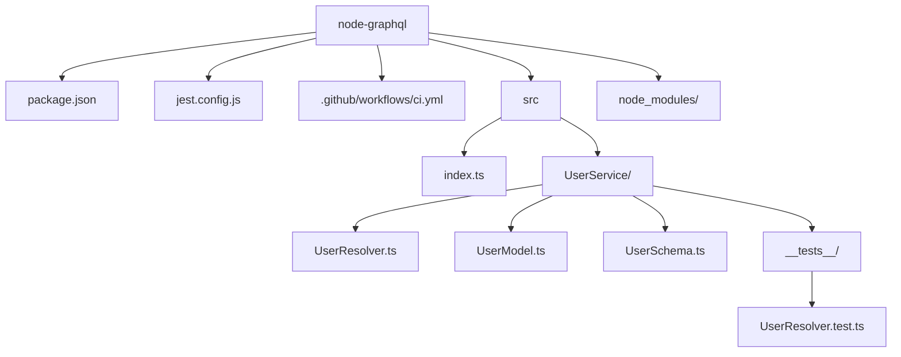

# node-graphql

This repository is a small GraphQL service using TypeScript, TypeGraphQL and Mongoose.

## Repo structure

The following Mermaid diagram shows the main files and folders:



## Running tests

CI runs `npm install` and `npm test` on pushes/PRs to `main` via GitHub Actions.

Locally you can run:

```bash
npm install
npm test
```
